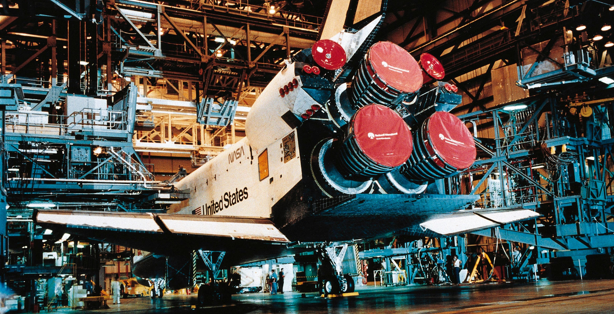

# 🧑‍🏫 Systems Engineering - Why and How?

Systems engineering is... actually really difficult to define. Wikipedia says it is _"an interdisciplinary field of engineering and engineering management that focuses on how to design, integrate, and manage complex systems over their life cycles."_ And because I'm lazy, that's the definition that we'll go with as well.

Lunabotics is one of the most complex robotics and engineering challenges available to students. There are a million ways for a project to fail because you forgot something important, and then you end up wasting all your team's resources creating something that doesn't work or wasn't delivered on time. (I know this from experience. Please don't repeat my mistakes.)&#x20;

So how do we make sure that doesn't happen? We implement a variety of practices and processes known as systems engineering to ensure what we want to make gets done on time, doesn't blow through our budget, and performs to the level we expect it to.

<figure><figcaption>
Imagine if NASA forgot a bolt or two when they were putting the Space Shuttle together for flight.
</figcaption></figure>

So let's return to our Wikipedia definition and break it down:&#x20;

_"an interdisciplinary field of engineering"_ - Systems engineering is useful for people who design and build things, regardless of their background.

_"design, integrate, and manage"_ - Systems engineering is a holistic method that helps you manage every aspect of bringing projects to life.

_"complex systems"_ - The more complicated a project is, the more necessary it is to implement systems engineering as part of your project management methodology. A lot of other engineering teams can get away with grinding out a project because, deep down, what they're designing isn't complicated. This is not true for Lunabotics.

_"over their life cycles"_ - We use systems engineering all the time as we develop a project, from initial inception to eventual disposal, a process known as cradle-to-grave product development.

<figure><figcaption>
Bringing a Lunabotics rover to life is only possible by successfully implementing systems engineering processes.
</figcaption></figure>

So what happens if we don't use systems engineering? Let's look at the Tennessee Lunabotics 2022-23 season as an example.

We missed the mark big time during our robot development. We expected to build a complex robot on an accelerated schedule with few financial details cemented beforehand. We hadn't even decided where the electrical box would go when we ordered parts - "_we'll figure that out when we get there_," we said. We had not fully defined our mechanical interfaces, and ended up with parts that didn't fit together because the manufacturing tolerances were way too loose.&#x20;

Needless to say, we did not make it to competition that year.

<figure><figcaption>
Things were not two-thumbs-up for long with the 2022-23 robot system.
</figcaption></figure>

We wasted _a lot_ of money, time, and resources that year. Team members were demoralized, and many did not return for the next year of competition. Our failure in the 2022-23 season was caused by a variety of additional issues, many related to lack of experience, supply chain issues due to COVID-19, and organizational drama.  But had we used proper systems engineering practices, these issues likely would not have been as severe, and we probably could have made it to Florida that May.

**Have I convinced you yet?**

In real engineering disciplines, systems engineering is a highly involved task. Companies have whole departments of individuals whose sole job it is to produce deliverables like design reviews and writeups. And let's face it - you're a college student. You would probably rather be doing something more worth your time on a Saturday night than pumping out a 100-page critical design review document.&#x20;

In this series, we will explore how to implement various core systems engineering practices in a way that isn't overbearing. Moreover, I think you'll find with further study that systems engineering is largely intuitive, formalizing things that are common sense for most engineers. Making these part of your product development cycle will help ensure that, at the end of the day, you get what you wanted to design in the first place. And you'll be able to bring the project of your dreams to life while having fun along the way!

