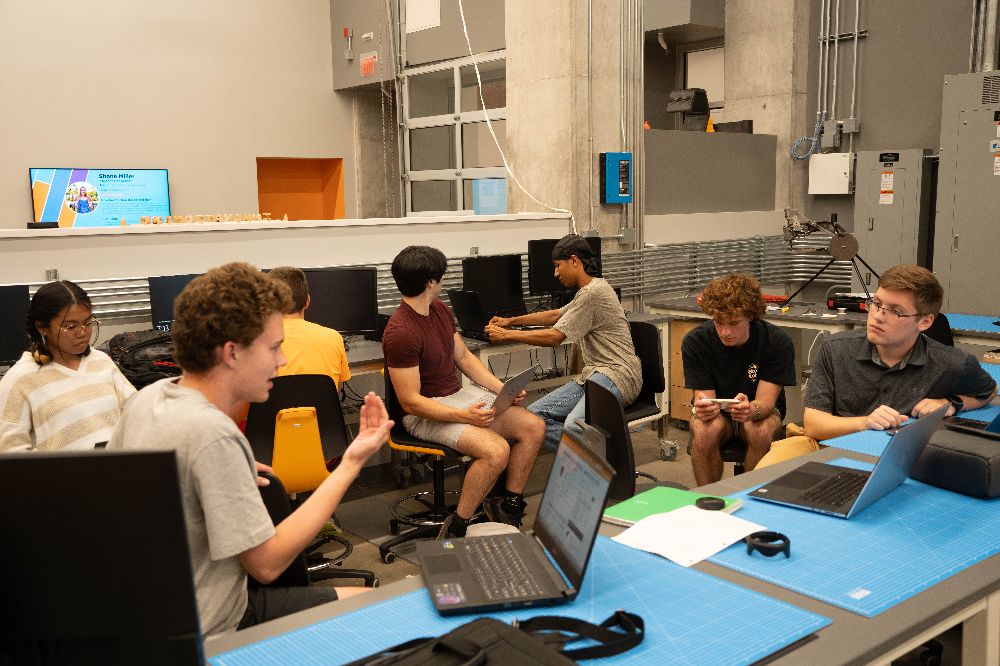
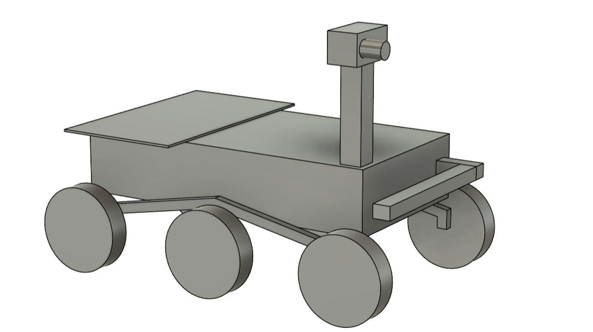
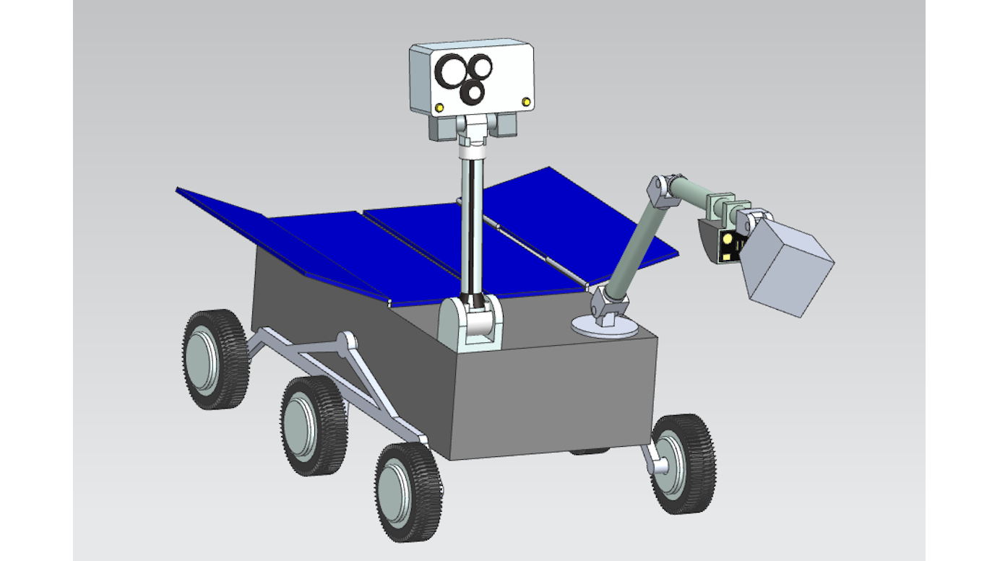
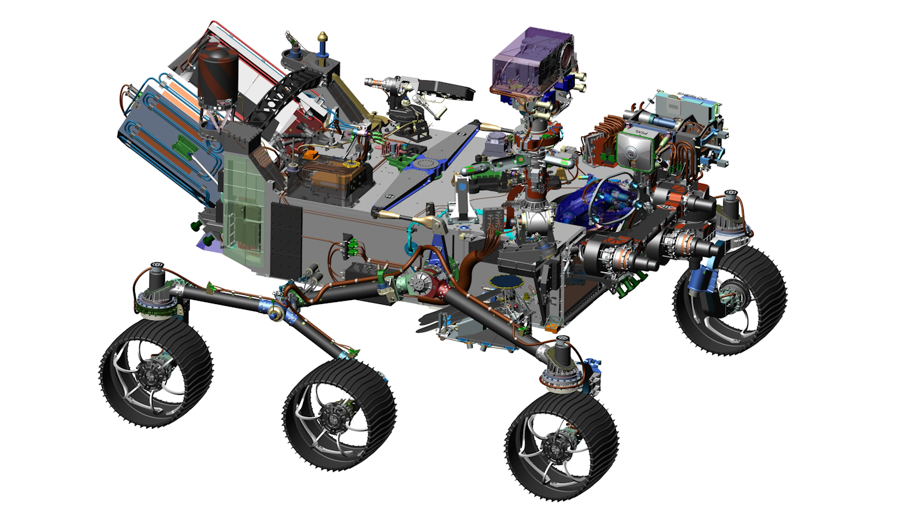

# 🌱 The Project Life Cycle

Now that I have (hopefully) convinced you of the necessity of implementing systems engineering practices, let's take a broad look at what a project managed using systems engineering looks like. When we break it down, all large-scale engineering projects typically follow a similar process known as the _project life cycle_. For Lunabotics purposes, we follow a simplified project life cycle like the one shown here, which is just complex enough to help us accomplish our goals while not being too overbearing.&#x20;

<figure><figcaption>
A simplified model of the project life cycle for our purposes.
</figcaption></figure>

For context, our project life cycle is based on, but not the same as, the one presented in [NASA's Systems Engineering Handbook](https://www.nasa.gov/reference/systems-engineering-handbook/). I will pull and condense a lot of information from this document. For all intents and purposes, this is the Bible for government-aligned space-focused project development.&#x20;

The project life cycle clearly defines activities that happen at each phase of product development. Interspersed throughout the timeline are design reviews, where the team comes together with outside reviewers to run through a total breakdown of the team's progress. Working with this process helps prevent errors from occurring in the first place. It also allows the team to stay one step ahead of any errors that happen to slip by, before they snowball into big resource-wasters.

## Our Example Mission

So, let's take a look at what happens during each phase of the project life cycle. Because I don't want to do the work for you, in this article, I'm going to provide a completely unrelated mission definition to run with. That way, we can walk through the process with examples.

The mission: **Design, build, and demonstrate an unmanned aerial vehicle system that is capable of planting seeds and performing repeated imaging missions to monitor crop health.** Let's also imagine we're given a guidebook with a bunch of additional project requirements like weight, size, power use, bandwidth, and more. We are given that to score more points, our seed-planting needs to be as precise as possible, and our images need to be high quality.

<figure><figcaption>
Modern farmers use advanced technology to stay competitive in today's agriculture market.
</figcaption></figure>

## Pre-Phase A: Concept Studies

From the NASA Systems Engineering Handbook: _"The purpose of Pre-Phase A is to produce a broad spectrum of ideas and alternatives for missions from which new programs/projects can be selected."_&#x20;

At the beginning of the project, you were given a mission concept along with a bunch of requirements. The main goal at this point is to start brainstorming and coming up with designs that might be able to achieve the goals of your mission. This is known as performing **concept studies.** At the end of this phase, you'll have multiple early concepts that the team will run with for a while.

The first step of this process is to review any and all documentation that you have been provided about your project. For us, this mainly involves the competition guidebook. One harsh truth I've seen in Lunabotics is that people who really want to be involved, but neglect to spend time at the beginning of the year reading through the guidebook, are unable to contribute effectively to the project. They eventually fall off. And this shouldn't be surprising at all - how are you going to solve a problem you don't even understand in the first place? Have the discipline to sit down with the guidebook early on and give it a read through. It's not a memorization game - you'll become more and more familiar with the guidebook over the year - but you need to become familiar _now_ with the overall scope of the competition and important rules like size, weight, and functionality requirements.

After you understand the problem, you can begin producing concepts to perform your mission. These concepts won't be detailed enough for you to know if you satisfy all competition requirements. However, the concepts should be realistic - something a group of college students could put together in a year's time.

<figure><figcaption>
It takes teamwork to bring a project to life.
</figcaption></figure>

Break your team up into 3-5 groups to produce concept studies. Ideally, the teams will place more experienced members alongside new members. Armed with knowledge of the competition rules and requirements, teams should put together a few ideas for possible mission platforms. This process should take no more than a week. Really, it could take one meeting if the team already knows what they're doing.

It's a good idea to take ideas from things that already exist. Be sure to review what technologies are already used in the field. In engineering, we classify technologies based on their **technology readiness level (TRL)**. The scale ranges from 1 to 9, with a higher score meaning the technology is more ready to be implemented in the field. An example of TRL 1 technology would be a Dyson swarm satellite system designed to harvest and redirect all the available power from the Sun. An example of TRL 9 technology would be a battery or solar panel. Higher TRL technologies are easier for you to implement.

Some concepts will flop immediately. Some may show promise but be quickly determined to be unfeasible. Some stellar ideas will rise to the top. Don't get an ego or get butthurt if yours fails. The team's goal is not to produce _your_ idea, the team's goal is to produce a _working_ idea. If those two happen to align, great! If not, know that it takes a lot of failed ideas to eventually produce a working idea. Notice I'm not using the words _good_ or _bad_ here - all ideas are good because, even if they don't work, they end up pointing the team closer to the right direction.

Let's assume your team came up with three promising aircraft ideas to perform the mission, a fixed-wing UAV, a quadcopter UAV, and a balloon UAV.&#x20;

<figure><figcaption>
Fixed-Wing UAV
</figcaption></figure>

 

<figure><figcaption>
Quadcopter UAV
</figcaption></figure>

 

<figure><figcaption>
Balloon UAV
</figcaption></figure>

## Phase A: Concept and Technology Development

From the NASA Systems Engineering Handbook: _"The purpose of Phase A is to develop a proposed mission/system architecture that is credible and responsive to program expectations, requirements, and constraints on the project, including resources."_

Once your team has come up with a few ideas to pursue, it's time to flesh them out. But first, an important system engineering milestone occurs during Phase A: the **System Requirements Review (SRR)**. This is a design review where the team comes together to make sure everyone understands the competition requirements before proceeding. To prepare for this, everyone should have read through the guidebook at least once. While concept studies are ongoing, a few team members from all project areas should produce a Requirements Document, going through the guidebook to identify and justify every requirement that the competition provides. This makes an easily accessible repository of requirements for all team members to access.

Once everyone understands the project requirements, we can proceed to perform a more detailed design of each of our mission concepts. This is where we open CAD for the first time and start to put together some basic geometry that shows what our system will generally look like. Identify basic subsystems that are required to make this system work. In addition to a 3-D design, concept teams should also put together a preliminary **Concept of Operations (ConOps)** that outlines how the proposed design will complete the required mission. The goal is to convince others that your design will work early on! Another module will explain how to make a great ConOps.

<figure><figcaption>
Phase A - CAD is mostly geometric and does not have to meet all requirements.
</figcaption></figure>

 

<figure><figcaption>
Phase B - CAD is becoming more detailed with accurate subsystems.
</figcaption></figure>

 

<figure><figcaption>
Phase C - CAD contains every single component, bolt, nut, etc.
</figcaption></figure>

This process should take no more than two weeks. Let's assume every concept team is able to put together some basic CAD in that timeframe. Using our example, let's say each team identifies the following subsystems: _aircraft, seed deployment, imaging, electronics,_ and _communication_.

## Phase B: Preliminary Design and Technology Completion

From the NASA Systems Engineering Handbook: _"The purpose of Phase B is for the project team to complete the technology development, engineering prototyping, heritage hardware and software assessments, and other risk-mitigation activities identified in the project Formulation Agreement (FA) and the preliminary design."_

In Phase B, the team will perform **downselection,** where one preliminary design is chosen out of all the others to proceed into further development. How do we do this objectively and efficiently without hurting feelings? **Trade studies** are a great engineering tool used for this sort of decision-making, which will be covered in-depth in another module.&#x20;

Every concept team should get up in front of the group and give a short presentation on their mission concept. They should explain the basic design, all relevant subsystems, where they're located and how they work. They should also run through the ConOps in a logical way to demonstrate how their system works together to achieve the goal. The audience should ask questions, trying to sus out any possible issues that may arise if the team were to proceed with this design.

<figure><figcaption>
An exemplary concept study performed in a previous Lunabotics season.  <em>(Note for the future: the team could turn this into a fifth systems engineering milestone known as a Mission Concept Review so you can net more points for going above and beyond in regards to your systems engineering implementation. It is done this way in industry, but I elected to remove it from our project life cycle just to make things a little simpler and more fun for everyone.)</em>
</figcaption></figure>

Once all concepts have been presented, the team needs to identify important criteria and perform a trade study to downselect to the top-scoring robot system. For our example, let's say the team decided to move forward with the quadcopter UAV. They eliminated the balloon UAV because it was not able to achieve enough precision for seed deposition. The fixed-wing UAV idea met a similar fate because it required a runway and had similar issues with precision while flying at high speeds. All great designs - two of them just weren't what we needed!

<figure><figcaption>
The quadcopter UAV has been selected for further development.
</figcaption></figure>

The team should now proceed with a more detailed CAD model of the quadcopter UAV, as well as a more detailed ConOps. We should have an idea now of the projected size of the vehicle, the projected size and location of each subsystem, preliminary power requirements, etc. Therefore, to make sure we still meet all competition requirements, it's time for another systems engineering milestone: the **Preliminary Design Review (PDR)**. We get together as a team and run through a presentation, giving everyone an in-depth rundown of the current design. External reviewers will also be involved to give us feedback we wouldn't have heard on our own. Any identified issues are fixed, and then we graduate into the next phase.

## Phase C: Final Design and Fabrication

From the NASA Systems Engineering Handbook: _"The purpose of Phase C is to complete and document the detailed design of the system that meets the detailed requirements and to fabricate, code, or otherwise realize the products."_

## Phase D: System Assembly, Integration and Test, Launch

From the NASA Systems Engineering Handbook: _"The purpose of Phase D is to assemble, integrate, verify, validate, and launch the system."_

## Phase E: Operations and Sustainment

From the NASA Systems Engineering Handbook: _"The purpose of Phase E is to conduct the prime mission to meet the initially identified need and to maintain support for that need."_

## Phase F: Closeout&#x20;

From the NASA Systems Engineering Handbook: _"The purpose of Phase F is to implement the systems decommissioning and disposal planning and analyze any returned data and samples."_
